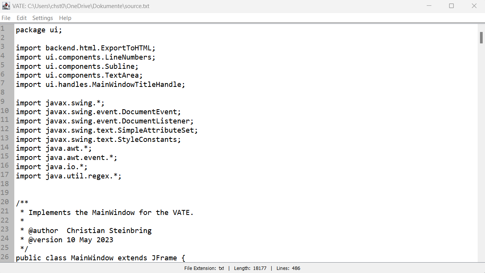

# Very Advanced Text Editor (VATE)

VATE is a lightweight text editor developed with Java Swing for educational purposes. This text editor can edit multiple text files at a time and provides basic functionalities that are needed when working with text files. More information about the editor can be found in the [description](#description).

 

 

## Table of contents
1. [Description](#description)
2. [How to Instal and Run the Project](#how-to-install-and-run-the-project)
3. [How to use the Project](#how-to-use-the-project)
4. [Contributors](#contributors)
5. [License](#license)
6. [How to Contribute](#how-to-contribute)

 

***
## Description
### Functionalities
The **V**ery **A**dvanced **T**ext **E**ditor VATE is a lightweight text editor that provides basic functionality for working with text files. The provided functionalities contain the following functions:

* Creating new files
* Opening existing files
* Saving edited files
* Saving edited files with a new path
* Exporting files to HTML
* Searching subtrings within the edited files

All these functionalites work while multiple files are opened simultaniously.

### Used Technologies
VATE's backend is developed with _Java_, with the frontend being developed with _Java Swing_. Therefore, VATE requires a working Java Runtime Environment (JRE) on your computer that supports **Java 17** to run the program.

The project uses _Apache Maven_ as build tool.

As of 29 May 2023, the project's only external dependency is Google's [gson](https://mvnrepository.com/artifact/com.google.code.gson/gson).

After careful consideration, these technologies were chosen for their simplicity and customizability.

 

***
## How to Install and Run the Project
If you want to use this project, you can either download this repository or the newest release:

### Download and Run this Repository
1. Download this repository from the [main](https://github.com/Christian-2003/VATE)-page.
2. Open your preferred IDE (we recommend using IntelliJ IDE).
3. In your IDE, create a new project from existing sources and select the downloaded repository.
4. Open the class `VATE` and execute it's `main()`-method.
5. Now, the text editor should be starting.

### Download and Run a Release
1. Download the newest release from the [releases](https://github.com/Christian-2003/VATE/releases)-page.
2. Either run the `.exe` (_this is recommended_) or run the `.jar`-file.
3. Now, the text editor should be starting.

 

***
## How to Use the Project
VATE behaves like any other computer program. You can navigate it's functions through the menu bar at the top of the program.

 

***
## Contributors
This project is being developed by the following developers:
Developer | Role
--- | ---
[Christian-2003](https://github.com/Christian-2003) | Head developer, Tester, Designer
[elekt0](https://github.com/Elekt0) | Developer, Tester, Git-Master, Automation

 

***
## License
The interpreter is licensed with the **MIT License**. See the full license [here](LICENSE.txt).

 

***
## How to Contribute
Feel free to contribute to this project.

### Code guidelines
Be a self-respecting person and use the common Java code practices that are taught in school and university.

The project will be developed in English!
